
<h1 align="center">医药信息管理系统+jsp</h1>

## 简介
医药信息管理系统：角色分为管理员、用户；提供用户注册、登录、个人中心、用户管理、药品类别管理、药品信息管理和系统管理功能，支持药品信息的录入、编辑、查询和批量删除等操作。    --计算机毕业设计源码；毕设源码；java毕业设计源码

## 联系方式

<h3 align="center">获取完整代码与数据库文件 + 微信：deepguan QQ: 86050149 QQ群: 783742310</h3>

<h3 align="center">可帮忙远程部署 包运行成功！提供远程部署、修改代码、设计文档指导、代码讲解等服务！</h3>

## 功能介绍（完整见运行截图）
管理员：基本功能包括登录、注册、用户信息管理、药品类别管理、药品信息管理和系统管理。管理员可以查看和编辑用户信息，管理药品类别和药品信息。具体操作包括新增、编辑、查看、删除药品类别和药品信息。系统管理模块提供了对整体系统参数及数据的配置与维护的权限，确保所有信息的完整性和安全性。管理员可通过功能模块进行快速导航，统一管理药品数据库及相关用户数据。

用户：用户功能主要包括登录、注册和个人信息管理。用户能在系统中浏览药品信息，包括药品概览、详细信息以及根据关键字搜索药品。同时用户可进行个人信息管理，更新如账号、姓名、年龄、联系方式等基本信息。用户通过提供的入口浏览不同药品类别，查看药品详情及使用信息，确保获取最新的产品信息。个人中心模块使用户可以灵活地管理和更新自己的信息，保证良好的用户体验。

## 运行截图
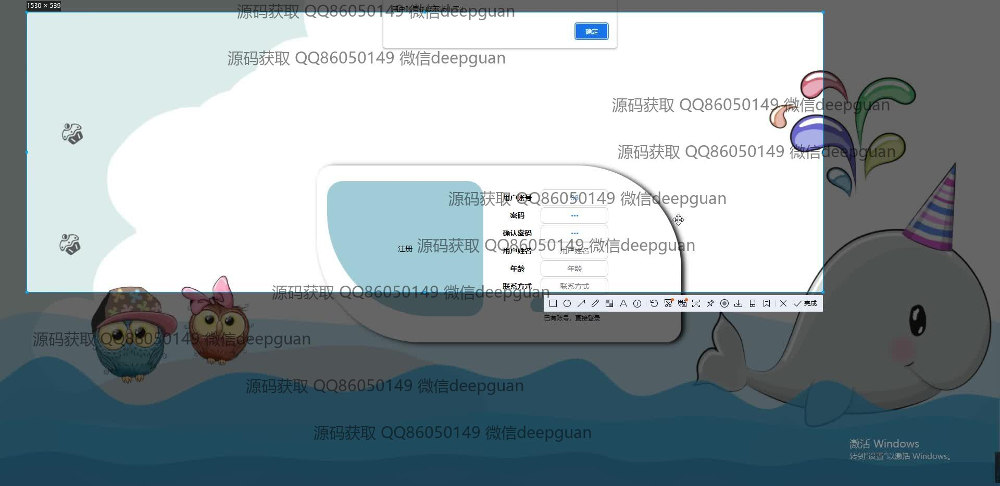
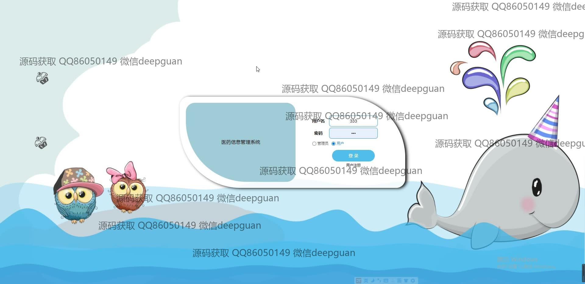
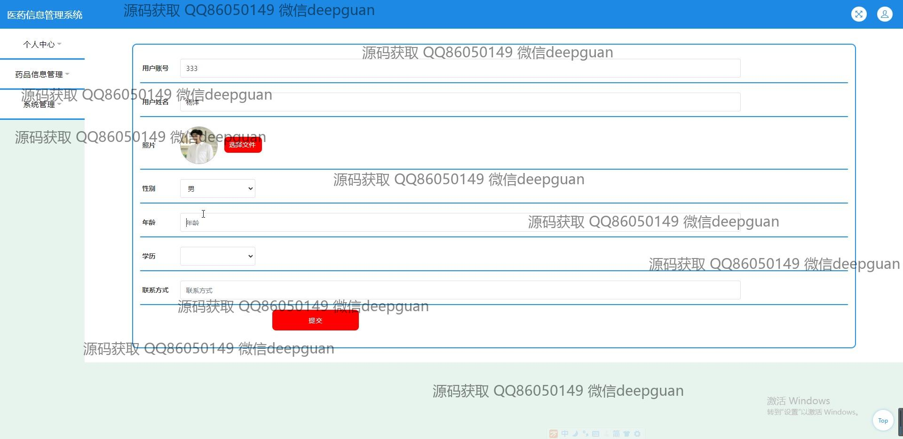
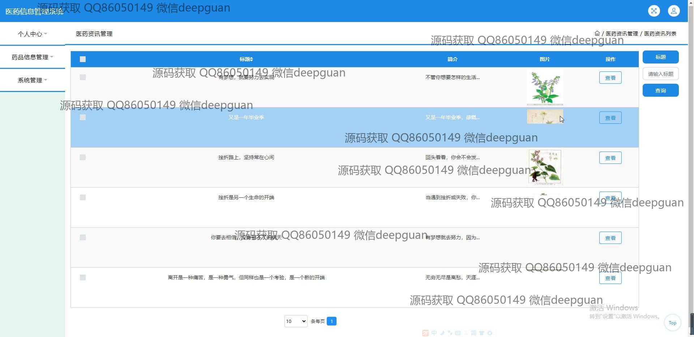
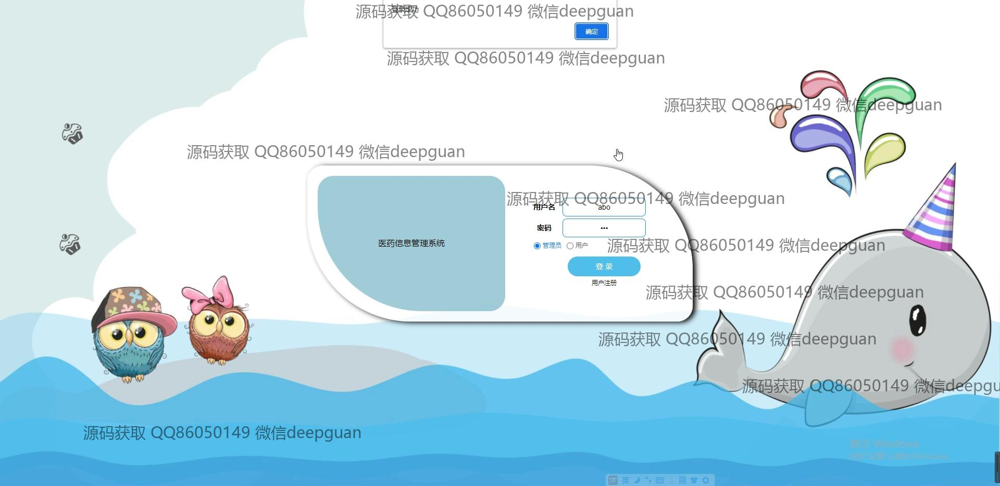
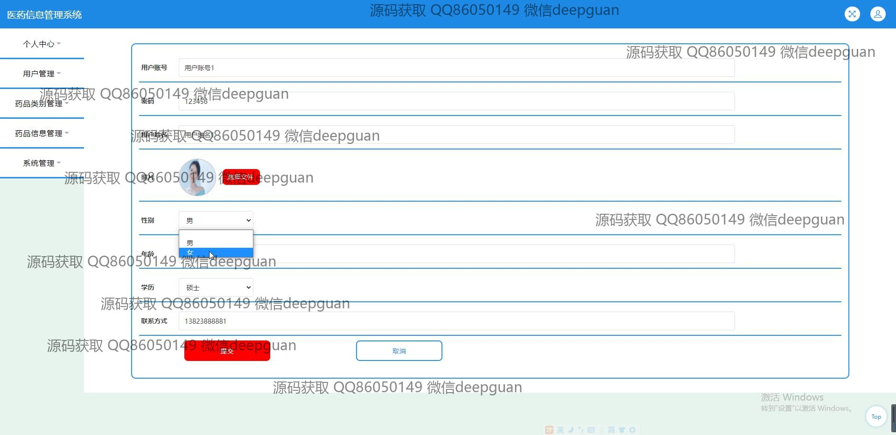
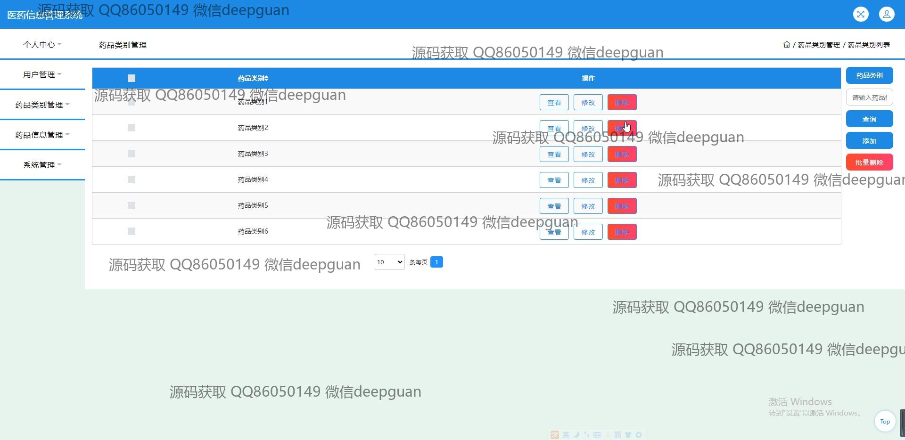
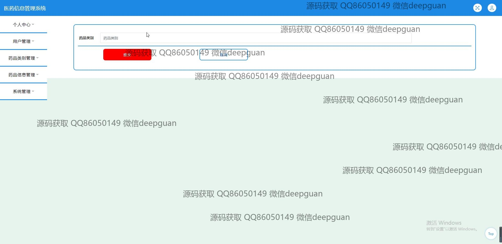
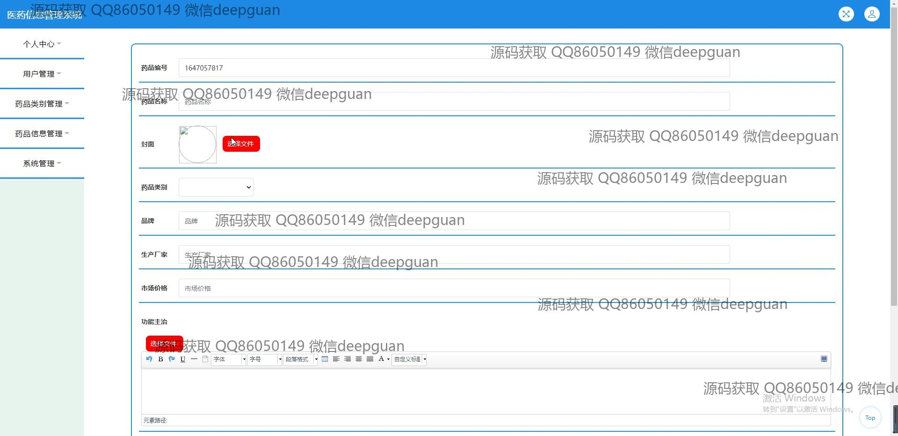
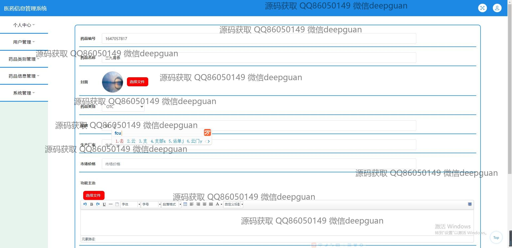
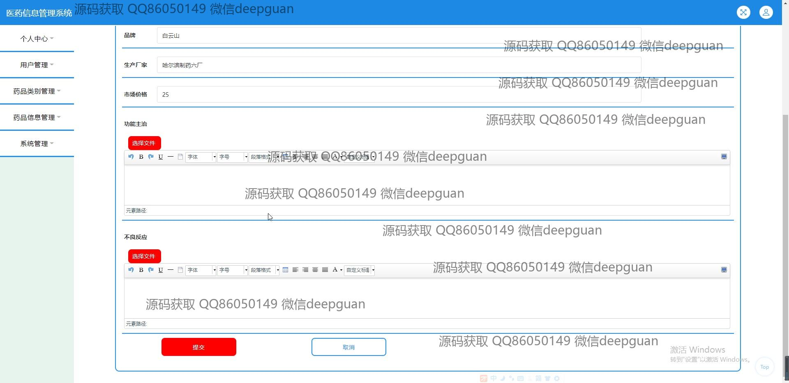
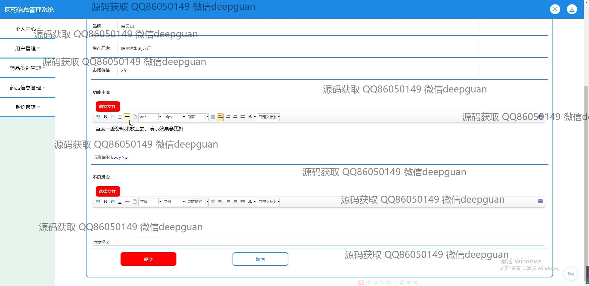
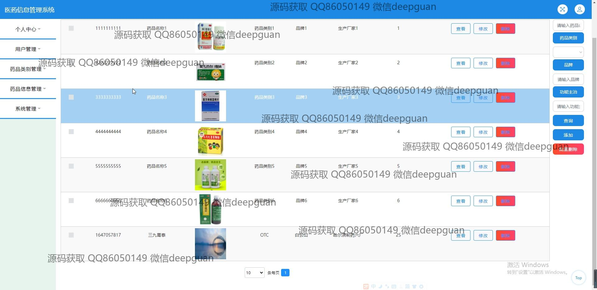
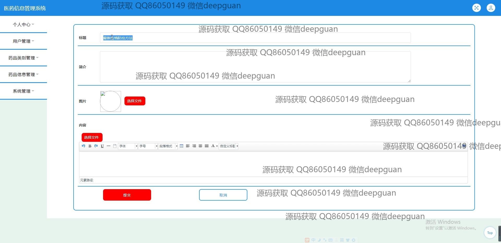
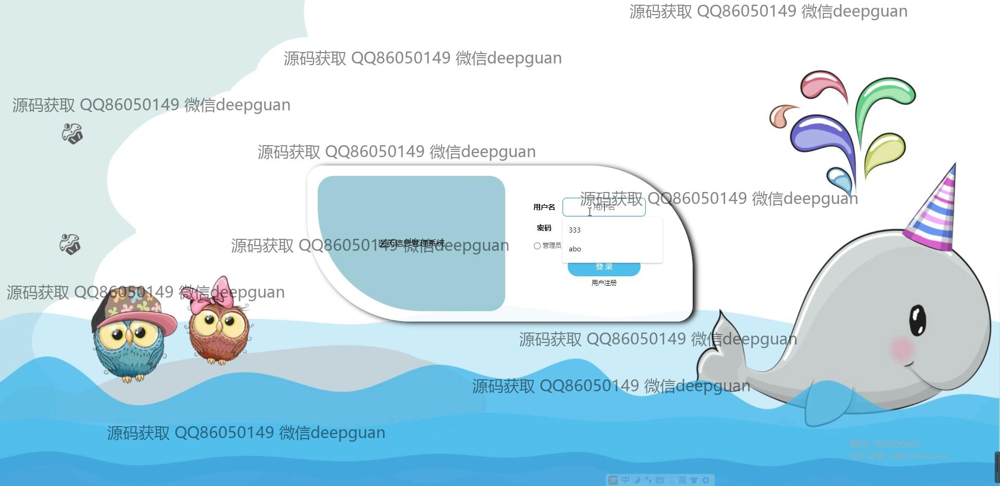
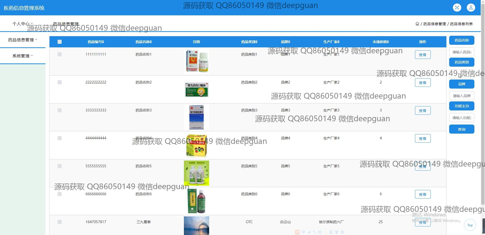
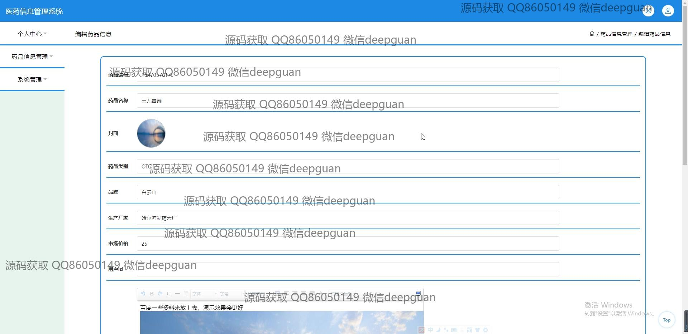

本代码来源于网络,仅供学习参考使用!

